<p align="center">
  
</p>

<h1 align="center">DepositSplit — Tenancy Deposit Arbiter</h1>

**Trustless tenancy deposit dispute resolution powered by GenLayer.**

- **No caller-controlled verdict:** `assess_case(case_id)` accepts only the case ID — never a verdict, classification, cost band, or deduction.
- **Independent verification:** Validators re-fetch move-in/move-out evidence URLs inside `gl.vm.run_nondet`.
- **LLM consensus:** Validators agree on damage class + cost band: `NO_DAMAGE` · `NORMAL_WEAR` · `MINOR_DAMAGE` · `MAJOR_DAMAGE` · `INSUFFICIENT_EVIDENCE`
- **Deterministic settlement:** Contract code derives `FULL_REFUND`, `DEDUCT`, `FORFEIT`, or `REVIEW`.
- **Fail-closed:** Broken URLs, empty evidence, invalid outputs, out-of-range values, or consensus disagreement → `REVIEW`, **never an automatic deduction**.
- **Live test:** `MINOR_DAMAGE → DEDUCT → 18,000/100,000 → 82,000 refund`

**Studionet:** `0x6a259e52F34a1BdDf1FEbE731Bb0353d734695D8`

**Evidence:** [`evidence-host.vercel.app`](https://evidence-host.vercel.app)

## Links

| Item | URL |
| ---- | --- |
| GenLayer Explorer | [explorer-studio.genlayer.com/address/0x6a259...695D8](https://explorer-studio.genlayer.com/address/0x6a259e52F34a1BdDf1FEbE731Bb0353d734695D8) |
| GenLayer Studio | [studio.genlayer.com/run-debug](https://studio.genlayer.com/run-debug) |
| Evidence Host | [evidence-host.vercel.app](https://evidence-host.vercel.app) |
| GitHub | [github.com/habte-selassie27/DepositSplit](https://github.com/habte-selassie27/DepositSplit) |

## Live deployment

| Item | Value |
| ---- | ----- |
| Network | studionet (`https://studio.genlayer.com/api`, chain 61999) |
| Contract | `0x6a259e52F34a1BdDf1FEbE731Bb0353d734695D8` |
| Deploy tx | `0x47144afac7a30684251f9b37496c9afa8c22e1e5aa980053a67b6e11f91169ca` |
| Consensus | `MAJORITY_AGREE` (5/5 accepted) |

Read-only check:

```shell
genlayer call 0x6a259e52F34a1BdDf1FEbE731Bb0353d734695D8 get_case_count
```

## Live test walkthrough

Evidence is hosted on Vercel as static HTML — the same pages validators
fetch during consensus.

### Evidence pages

**Landing page** — links to both reports:

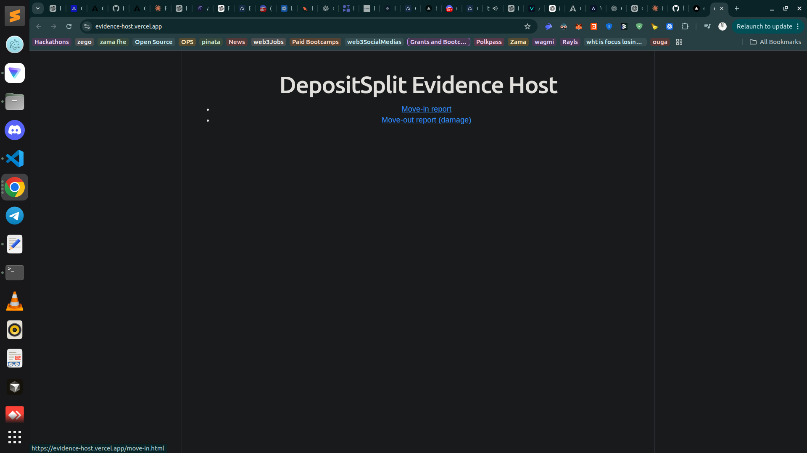

**Move-in report** — clean condition, no damage:

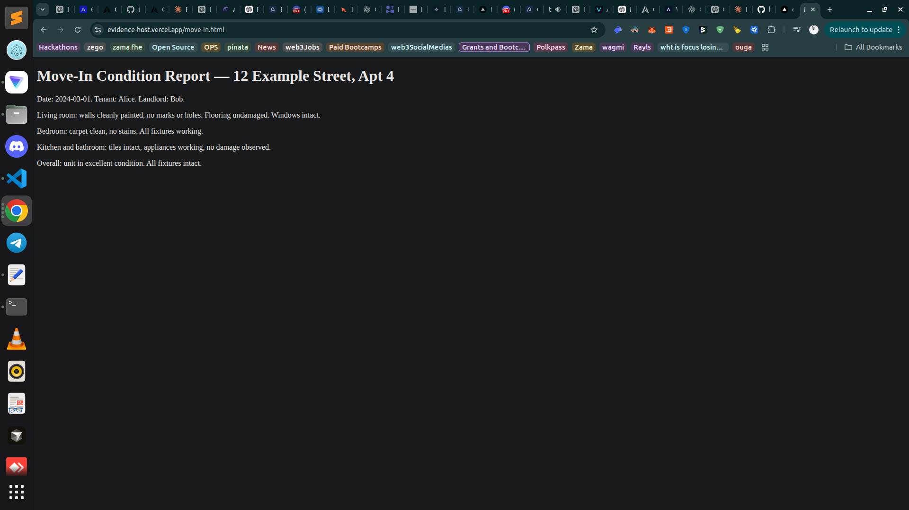

**Move-out report** — documented minor damage (hole + stained carpet):

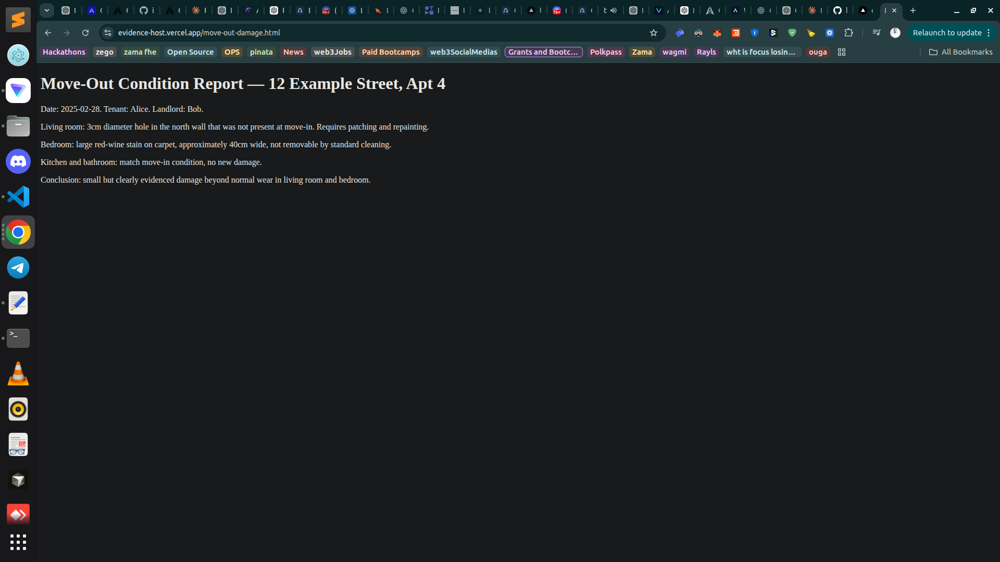

### CLI: lint + test + deploy + assess + read settlement

Set network to studionet:

```shell
genlayer network set studionet
```

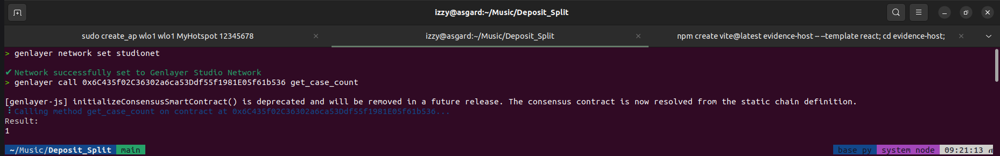

Lint the contract:

```shell
genvm-lint check contracts/deposit_split.py
```

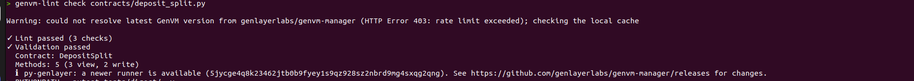

Run the test suite (61 tests):

```shell
PYTHONPATH=. pytest tests/direct/ -v
```

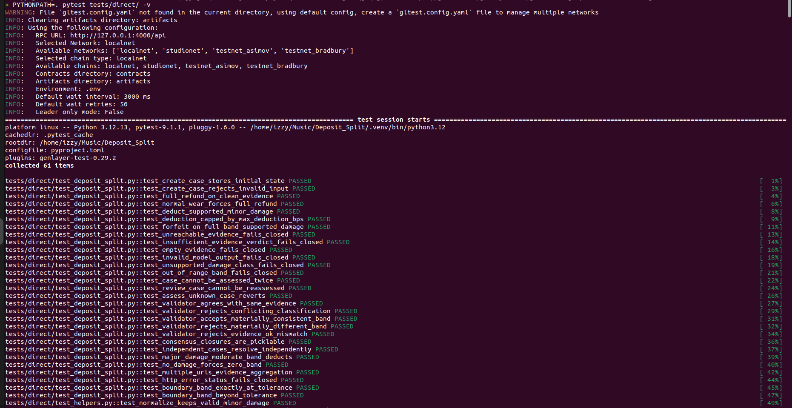
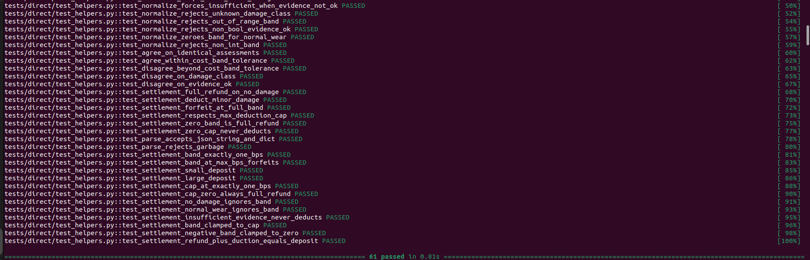

Read the current case count:

```shell
genlayer call 0x6a259e52F34a1BdDf1FEbE731Bb0353d734695D8 get_case_count
```

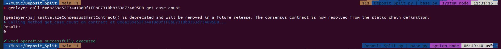

Create a case with Vercel evidence URLs:

```shell
genlayer write 0x6a259e52F34a1BdDf1FEbE731Bb0353d734695D8 create_case --args "Tenant Alice" "Landlord Bob" "inventory-hash-demo" '["https://evidence-host.vercel.app/move-in.html"]' '["https://evidence-host.vercel.app/move-out-damage.html"]' 100000 10000
```

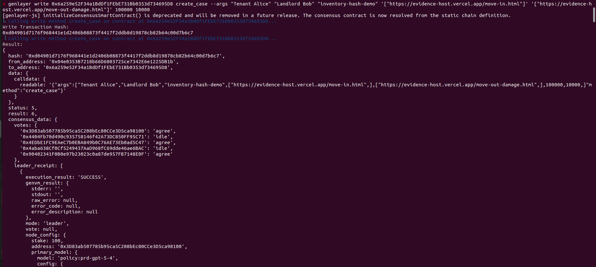
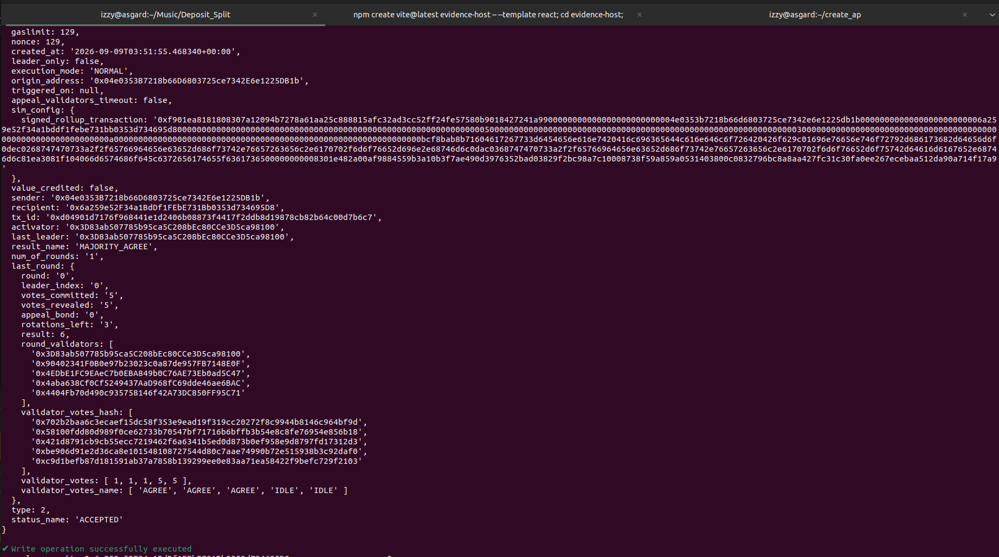

Run the assessment — validators independently re-fetch the evidence:

```shell
genlayer write 0x6a259e52F34a1BdDf1FEbE731Bb0353d734695D8 assess_case --args 0
```

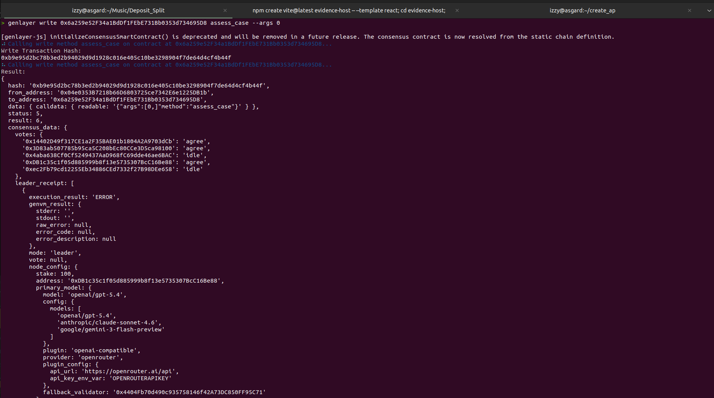
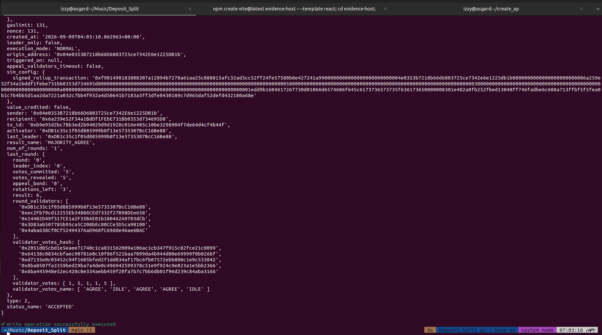

Read the settlement:

```shell
genlayer call 0x6a259e52F34a1BdDf1FEbE731Bb0353d734695D8 get_settlement --args 0
```

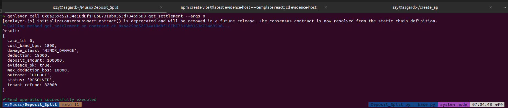

### Result

| Field | Value |
| --- | --- |
| outcome | `DEDUCT` |
| damage_class | `MINOR_DAMAGE` |
| cost_band_bps | 1800 (18%) |
| deduction | 18000 of 100000 |
| tenant_refund | 82000 |
| status | `RESOLVED` |

## What it does

A landlord and tenant register a deposit case with:

- an inventory reference hash
- move-in evidence URLs and move-out evidence URLs
- the deposit amount
- a maximum deduction cap (`max_deduction_bps`, 0–10000)

When `assess_case(case_id)` is called, the caller provides **only the case
id** — never a verdict. Inside `gl.vm.run_nondet`:

1. The **leader** fetches every evidence URL from the web
   (`gl.nondet.web.render`) and evaluates it with an LLM
   (`gl.nondet.exec_prompt`), producing a strict JSON assessment:
   `damage_class` (`NO_DAMAGE` / `NORMAL_WEAR` / `MINOR_DAMAGE` /
   `MAJOR_DAMAGE` / `INSUFFICIENT_EVIDENCE`), `cost_band_bps`, `evidence_ok`.
2. Each **validator** independently re-fetches and re-evaluates the same
   evidence and enforces an explicit **semantic equivalence principle** in
   contract code: identical damage classification, identical `evidence_ok`,
   and a cost band within a fixed 500 bps tolerance.
3. Only after consensus does **deterministic code** derive the settlement:

| Consensus result                          | Settlement                                  |
| ----------------------------------------- | ------------------------------------------- |
| `NO_DAMAGE` / `NORMAL_WEAR`               | `FULL_REFUND` (band forced to 0)            |
| supported damage, band ≤ cap              | `DEDUCT` (deduction = deposit × band/10000) |
| supported damage reaching the full amount | `FORFEIT`                                   |
| unreachable/empty/contradictory evidence  | `REVIEW` — no deduction authorized          |
| invalid model output or bad values        | `REVIEW` — fail closed                      |
| validator disagreement                    | transaction reverts, case stays `OPEN`      |

The deduction is always additionally bounded by the case's configured
`max_deduction_bps` — consensus on the facts can never exceed the cap the
parties agreed to at creation.

Contract API (`contracts/deposit_split.py`):

- `create_case(tenant, landlord, inventory_hash, move_in_urls, move_out_urls, deposit_amount, max_deduction_bps) -> case_id`
- `assess_case(case_id)` — runs consensus, writes `RESOLVED` or `REVIEW`
- `get_case(case_id)`, `get_settlement(case_id)`, `get_case_count()` — views

## Why this needs GenLayer

A deterministic smart contract cannot open a URL, look at the difference
between two property-condition reports, and decide whether claimed damage is
supported. DepositSplit uses GenLayer's non-deterministic web access and
LLM execution inside the consensus flow for that real-world evidence layer —
while keeping the financial calculation fully deterministic. The subjective
part (what does the evidence show?) is decided by validator consensus; the
arithmetic part (how much is deducted?) is decided by code.

## Safety model

1. The caller cannot choose the outcome — no method accepts a verdict,
   classification, band, or deduction.
2. Evidence is stored as URL references and **re-fetched by every validator**
   during consensus.
3. Semantic equivalence is enforced by explicit validator code, not by
   byte comparison and not by trusting the leader.
4. Every failure mode (unreachable URL, empty content, malformed model
   output, unknown damage class, out-of-range band, missing evidence)
   lands the case in `REVIEW` — it never produces a deduction.
5. A case can be assessed exactly once (`OPEN → RESOLVED | REVIEW` are
   terminal transitions).
6. Closures crossing the consensus boundary capture only plain data
   (verified by a pickling test).

## Project structure

```
contracts/deposit_split.py         # the Intelligent Contract (single file, Studio-ready)
tests/direct/conftest.py           # shared mock helpers (evidence URLs, LLM mocks)
tests/direct/test_helpers.py       # unit tests: normalization, equivalence, settlement math, edge cases
tests/direct/test_deposit_split.py # direct-mode tests with web/LLM mocks + validator checks
docs/ARCHITECTURE.md               # trust boundary, consensus flow, fail-closed matrix
docs/SUBMISSION.md                 # GenLayer portal submission text + evidence checklist
scripts/demo_testnet.py            # deploy + 3-case demo (clean / damage / broken URL)
.vscode/settings.json              # silences Pylance false positives on genlayer SDK names
```

## Local development

Requirements: Python ≥ 3.12.

```shell
python3 -m venv .venv
source .venv/bin/activate
pip install -r requirements.txt

# Lint the contract (GenVM linter — the authoritative check)
genvm-lint check contracts/deposit_split.py

# Fast in-memory tests (no Studio required)
PYTHONPATH=. pytest tests/direct/ -v
```

Direct mode runs the real contract code in-memory with mocked web/LLM
responses and includes validator simulation
(`direct_vm.run_validator()`), so consensus agreement, conflict rejection,
and cost-band tolerance are all exercised locally. `PYTHONPATH=.` is
required because the tests import via the `tests.` package path.

Current suite: **61 passed** — 23 contract-flow tests (creation, outcomes,
fail-closed paths, replay protection, validator consensus, pickling,
multi-case isolation, tolerance boundaries) plus 38 helper tests
(normalization, equivalence, settlement math, caps, zero/small/large
deposits, and a `tenant_refund + deduction == deposit` invariant over 600
combinations).

### VS Code

- Set the Python interpreter to `.venv`.
- `.vscode/settings.json` is checked in: it disables Pylance
  `reportUndefinedVariable` / wildcard-import / missing-import diagnostics
  for the `genlayer` SDK names (`gl`, `u256`, `DynArray`, `TreeMap`,
  `allow_storage`), which Pylance cannot resolve statically but GenVM
  provides at runtime. `genvm-lint` remains the source of truth.
- The official **GenLayer** extension (publisher `genlayer-labs`) detects
  the `# { "Depends": "py-genlayer:... }` header and adds contract tooling.

## Deploying

`contracts/deposit_split.py` is self-contained — paste it directly into the
[GenLayer Studio](https://studio.genlayer.com/) contract editor, or use the
CLI:

```shell
npm install -g genlayer   # CLI v0.39+ works; repo used 0.39.2
genlayer network set studionet   # or: localnet | testnet-bradbury
genlayer account show            # check balance; fund via faucet if needed
genlayer deploy --contract contracts/deposit_split.py
```

Then interact with the deployed contract (replace `$ADDR`):

```shell
genlayer call $ADDR get_case_count
genlayer write $ADDR create_case --args "Tenant Alice" "Landlord Bob" "inventory-hash-demo" '["https://your-host/move-in.html"]' '["https://your-host/move-out.html"]' 100000 10000
genlayer write $ADDR assess_case --args 0
genlayer call $ADDR get_settlement --args 0
```

Evidence URLs must be publicly reachable — validators re-fetch them during
consensus, so `localhost` URLs will fail closed into `REVIEW`.

End-to-end demo (deploy + clean / damage / broken-URL cases) via script:

```shell
source .venv/bin/activate
python scripts/demo_testnet.py \
  --move-in-url https://your-host/case-clean/move-in.html \
  --move-out-url https://your-host/case-clean/move-out.html \
  --damaged-move-out-url https://your-host/case-damage/move-out.html
# add --chain localnet for a local simulator, --address $ADDR to reuse a deployment
```

## Reusing the primitive

DepositSplit is deliberately application-agnostic. The same
*evidence-URLs-in / consensus-classification / deterministic-settlement-out*
shape applies to property damage claims, equipment rentals, vehicle rentals,
contractor security deposits, and any escrowed deposit whose release
depends on real-world evidence. For production money movement, pair it with
a token/escrow contract and an explicit legal ruleset — see
[docs/ARCHITECTURE.md](docs/ARCHITECTURE.md) for extension points.

## Honest limitations

- Evidence is fetched as **text** (`web.render` in text mode). Photo-native
  assessment via screenshot rendering + `exec_prompt(images=[...])` is a
  documented extension point, not implemented in v1.
- The contract tracks settlement figures; it does not custody funds. Escrow
  integration is an extension point.
- `REVIEW` is a terminal state in v1 — a human process (or a future appeal
  method) resolves it off-chain.

## License

MIT
